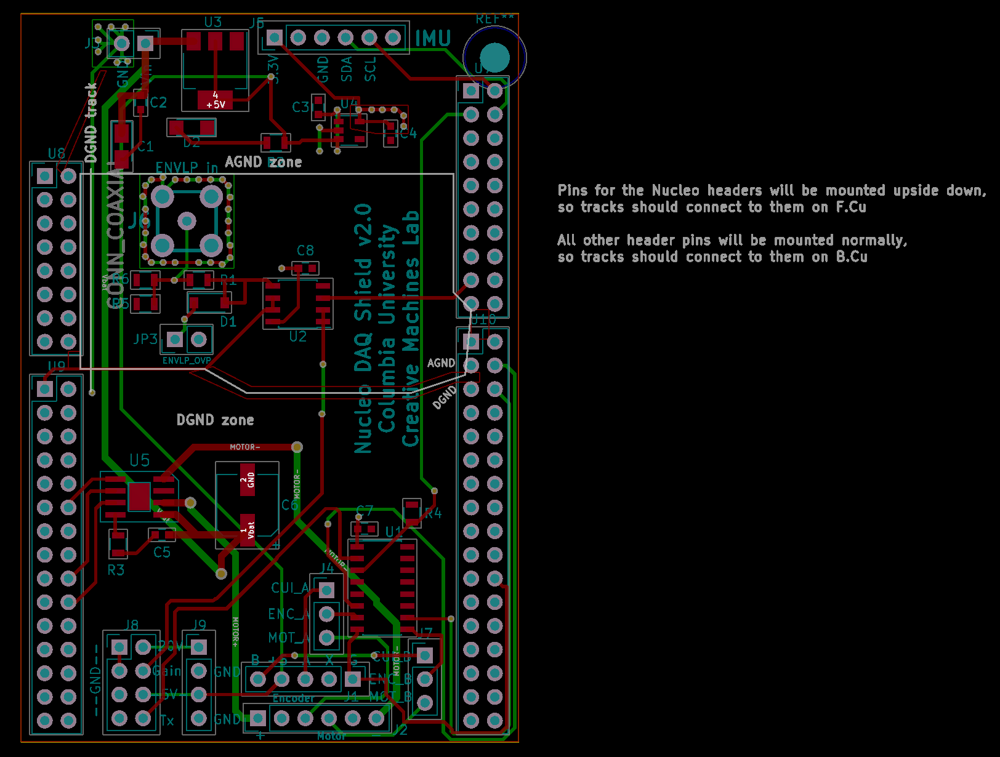

# Nucleo DAQ Shield
The Nucleo DAQ Shield mixed signal PCB that houses connectors and auxiliary circuitry (buffers, H-bridge, voltage regulators). It allows the STM32 microcontroller to interface with the [Analog Frontend](https://github.com/ColumbiaOpenSourceUltrasound/Analog_Frontend), motor, and other sensors.

### Drawings
Schematic:  
  
See the `drawings` folder for a high-resolution PDF version.

PCB:  
  
See the `drawings` folder for a full resolution PDF version, including each layer individually. 

3D view:  

### Bill of Materials
See `Nucleo_DAQ_Shield.html`.

### Changelog
* `v1.0` Initial design.
* `v1.2` 
* `v1.3` Changed dimensions to improve manufacturability.
* `v2.0` Replaced several components; added connector for IMU and jumpers to switch between internal/external encoder.

### Credits
Designed by William Meng and Ruoyu Sheng.

The motor control circuitry was adapted from the [Adafruit DRV8871 breakout board](https://learn.adafruit.com/adafruit-drv8871-brushed-dc-motor-driver-breakout/download).

The [Arduino Shield module](https://www.thingiverse.com/thing:9630) by nicholasclewis helped with aligning the header pins.

